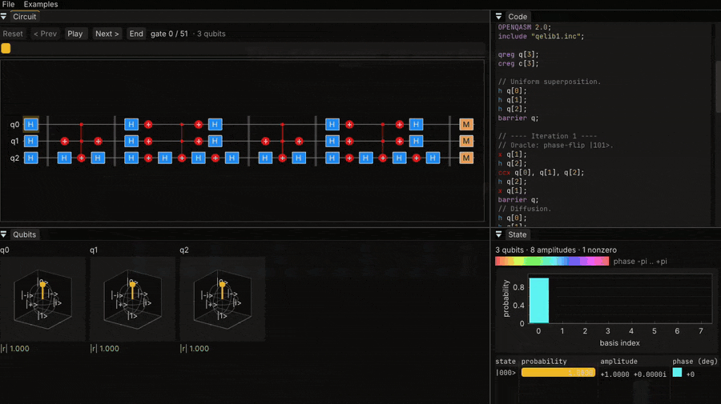

<div align="center">
  
</div>

<h6 align="center">
    <a href="https://brenocq.github.io/ket/demo/">Online demo</a>
    ·
    <a href="https://brenocq.github.io/ket/">Website</a>
    ·
    <a href="#examples">Examples</a>
    ·
    <a href="#benchmark">Benchmark</a>
</h6>

<div align="center">
  <a href="https://github.com/brenocq/ket/actions/workflows/linux.yml"></a>
  <a href="https://github.com/brenocq/ket/actions/workflows/macos.yml"></a>
  <a href="https://github.com/brenocq/ket/actions/workflows/windows.yml"></a>
  <a href="LICENSE"></a>
  <a href="https://github.com/sponsors/brenocq"></a>
</div>

**Ket** (|⟩) is a quantum computing library for C++20, with first-class Python
bindings. You build a circuit, simulate it on a built-in state-vector
simulator, and sample measurement outcomes — from C++, from Python, the command
line, a desktop GUI, or right in your browser.

<div align="center">
  <a href="https://brenocq.github.io/ket/demo/"></a>
  <p>
    <b><a href="https://brenocq.github.io/ket/demo/">▶&nbsp; Try the debugger in your browser</a></b><br/>
    No install — step a circuit gate by gate and watch every amplitude and Bloch vector.
  </p>
</div>

Internally a circuit is a **directed acyclic graph (DAG)** of gates: each node is
a gate and edges connect gates that share a qubit. This makes gate dependencies
explicit and leaves room for future analysis and optimization passes.

## Features

- **A broad gate set** — Paulis, phase and `T` gates, parameterized rotations
  (`Rx`/`Ry`/`Rz`), the general single-qubit `U`, their controlled forms
  (including controlled rotations and controlled-phase), `SWAP`, and the
  three-qubit Toffoli (`CCX`) and Fredkin (`CSWAP`).
- **Exact state-vector simulation** of the full `2ⁿ` amplitude vector,
  **multithreaded** across a persistent `std::` thread pool (`set_num_threads`),
  with gate fusion.
- **Automatic backend selection** — Clifford circuits are routed to an `O(n²)`
  stabilizer simulator (scaling to thousands of qubits), everything else to the
  state vector. The choice is automatic but overridable.
- **Measurement and sampling** into a classical register, for shot experiments.
- **Composite gates** — package a sub-circuit into a reusable, labeled block,
  and `decompose()` it back into primitives.
- **Qiskit-style ASCII diagrams** via `circuit.print()`.
- **OpenQASM 2.0** import and export, including user-defined `gate` blocks.
- **Python bindings** (built with [pybind11]) that mirror the C++ API.
- **Tooling** — a `ket-cli` command-line tool and a `ket-gui` circuit viewer.

The complete list of gate methods lives in
[`include/ket/circuit.hpp`](include/ket/circuit.hpp).

## Building

Ket uses CMake and a C++20 compiler. By default `build.sh` builds everything —
the library, the example programs, and the `ket-cli` and `ket-gui` executables;
`--help` lists the rest (focused builds, the test runners, and the Python
bindings).

```sh
./build.sh          # build everything
./build.sh --help   # all options
```

`./build.sh --install` installs ket under `/usr/local`: the `ket-cli` and
`ket-gui` executables, plus the library, headers, and a CMake package config so
other projects can `find_package(ket)` and link `ket::ket`. `--uninstall`
removes it.

## Examples

The [`examples/`](examples) directory has runnable programs — Bell and GHZ
states, the Deutsch–Jozsa and Bernstein–Vazirani algorithms, a bit-flip code,
and Grover's search. Once built, run them from `build/examples/`:

```sh
./build/examples/bell
./build/examples/grover
```

## CLI

`ket-cli` operates on OpenQASM files (or stdin, so it composes in pipelines):

```sh
./build/cli/ket-cli draw   examples/bell.qasm                 # ASCII diagram
./build/cli/ket-cli run    examples/bell.qasm                 # final state vector
./build/cli/ket-cli sample examples/bell.qasm --shots 1000    # measurement histogram
```

## GUI

`ket-gui` is a step-through debugger: an editable QASM panel, a circuit view,
the live state vector, and per-qubit Bloch spheres (GLFW, Dear ImGui, ImPlot).
**The fastest way to try it is the [live demo](https://brenocq.github.io/ket/demo/)**
— it's the desktop GUI compiled to WebAssembly, no install required.

To run it natively:

```sh
./build/gui/ket-gui examples/grover.qasm
```

## C++

To use ket as a library, link the `ket` target, add `include/` to your include
path, and include the umbrella header `<ket/ket.hpp>`.

```cpp
#include <ket/ket.hpp>
#include <iostream>

int main() {
  // A Bell state: H on q0, then CNOT(q0 -> q1).
  ket::Circuit c{2};
  c.h(0);
  c.cx(0, 1);

  std::cout << c.print();            // ASCII circuit diagram
  std::cout << ket::run(c).print();  // final state vector
}
```

```
     ┌───┐
q_0: ┤ H ├──■──
     └───┘┌─┴─┐
q_1: ─────┤ X ├
          └───┘
|00⟩: 0.707107
|01⟩: 0
|10⟩: 0
|11⟩: 0.707107
```

## Python

The Python API mirrors the C++ one — `Circuit`, `run`, `measure`, `sample` —
with a few Pythonic touches: `Circuit` and `State` render through
`print()`/`str()`, `State` supports `len()` and indexing (returning a Python
`complex`), and `measure`/`sample` take an optional `seed`.

The bindings compile from source via [scikit-build-core], so a C++20 compiler
and CMake are required:

```sh
python -m venv .venv
source .venv/bin/activate
pip install .                 # or: pip install --editable ".[test]" for development
```

```python
import ket

c = ket.Circuit(2)
c.h(0)
c.cx(0, 1)
c.measure_all()

print(c)                       # circuit diagram
print(ket.run(c))              # state vector
print(ket.sample(c, seed=0))   # one shot, e.g. [0, 0] or [1, 1]
```

## How it works

A register of *n* qubits is a vector of `2ⁿ` complex amplitudes. Each gate is
applied as an in-place linear transformation over that vector — qubit `i` is
bit `i` of the basis-state index (little-endian). The simulator walks the DAG
in topological order (which matches insertion order) and applies each gate in
turn. **Measurement** samples a basis state by the Born rule (outcome `i` with
probability `|amplitudeᵢ|²`), with an optional seed for reproducibility.

Because the state vector stores all `2ⁿ` amplitudes, simulation is exact but
bounded by memory — practical up to roughly 25 qubits. There is no noise
modeling.

**Backends.** `sample` and `expval` go through `simulate(circuit, method)`,
which picks an engine: a **Clifford** circuit (only `H`/`S`/`Sdg`/`X`/`Y`/`Z`/
`CX`/`CY`/`CZ`/`SWAP`) is run on a stabilizer tableau in `O(n²)` time and memory
— thousands of qubits — while anything else uses the state vector. `method`
defaults to `auto` but can be forced to `statevector` or `stabilizer`
(`is_clifford(circuit)` / `chosen_method(circuit)` report the decision). The
stabilizer engine never forms a `2ⁿ` vector, so `run()` — which returns the full
state vector — is always the dense path.

The state-vector backend applies each gate's `2ⁿ`-amplitude update across a
persistent `std::thread` pool (the pairs are independent, so the split needs no
locks). `set_num_threads(n)` controls it — `0` selects the hardware concurrency;
it defaults to `1` (or `KET_NUM_THREADS`). Small states stay serial, since the
synchronization would cost more than the work. Consecutive gates on the same
qubits are **fused** into one combined gate, so a deep circuit makes fewer
sweeps over the state vector.

## Roadmap

- DAG optimization passes (gate cancellation, commutation, fusion) and a
  scheduler that no longer relies on insertion order.
- A state panel in the GUI (amplitudes / Bloch-style plots via ImPlot3D).
- More backends behind `simulate()` — e.g. a tensor-network (MPS) simulator.
- Cache-blocking with qubit reordering, to fuse across non-adjacent qubits
  without thrashing the cache (the remaining gap to Aer on deep circuits).

## Benchmark

Generated by the [benchmark script](.github/scripts/benchmark).

<div align="center">
  
</div>

## License

MIT © 2026 Breno Cunha Queiroz
